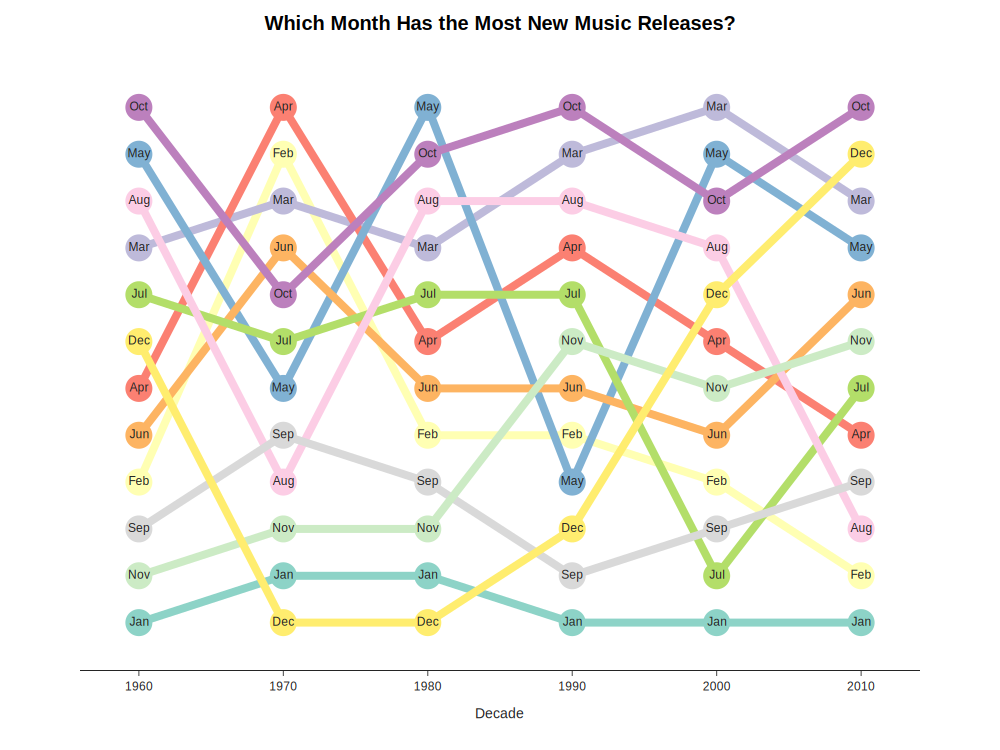

# Hot or Not: Billboard Github Repository and Code Walkthrough

Welcome to the repository for my Medium analysis of the Billboard Hot 100! This repository reviews how I gathered, cleaned, analyzed and visualized the Hot 100 Charts over time.

In case you missed the article, this project involved downloading chart entries from the Billboard Hot 100 and discovered: 

- Each year, fewer and fewer artists make the Hot 100, suggesting pop music is becoming more exclusive
- Artists release more music per capita in the 2010's than in the 70's/80's/90's (how much more)
- On-demand streaming means artists nowadays chart more singles on the Hot 100 vs. the CD era (where singles only gained traction through radio-play)
- January and February see the fewest new music releases, while March and October see the most new music on the chart

## Getting Started: Data Scraping and Wrangling
This project leverages [Chris Guo's Billboard scraping library](https://github.com/guoguo12/billboard-charts) - it provides access to all Billboard Charts (Hot 100, Artist 100, Album 200, etc.) for all time, that are hosted at billboard.com. 

To use the library, you enter a chart name and "YYYY-MM-DD" date, and the scraper returns a `ChartData` object. This in turn contains individual `ChartEntry` objects which each contain:

- `title` – The title of the track.
- `artist` – The name of the artist, as formatted on Billboard.com (including featured and side artists)
- `rank` – The track's position on the chart on that date.

Chris has been gracious enough to add other features to this library, but for this analysis these are the main three that we need. In scrape.py, I extended Chris's functionality to better suit my project needs by saving `ChartData` objects to my own custom data structure: 

`(ChartData.name, ChartData.date, [{'title': i.title, 'artist': i.artist, 'rank': i.rank} for i in ChartData.entries])`

Downloading the data in this format enables me to download and house data for one or more charts across multiple years (even from inception-to-date) in a single file. Here's what the raw data looks like:

```json
("The Hot 100", "2020-09-26", [
    {"title": "WAP", "artist": "Cardi B Featuring Megan Thee Stallion", "rank": 1}, 
    {"title": "Dynamite", "artist": "BTS", "rank": 2}, 
    {"title": "Laugh Now Cry Later", "artist": "Drake Featuring Lil Durk", "rank": 3}, 
    {"title": "Rockstar", "artist": "DaBaby Featuring Roddy Ricch", "rank": 4}, 
    {"title": "Blinding Lights", "artist": "The Weeknd", "rank": 5}, 
    {"title": "Mood", "artist": "24kGoldn Featuring iann dior", "rank": 6}, 
    {"title": "Watermelon Sugar", "artist": "Harry Styles", "rank": 7}, 
    {"title": "Savage Love (Laxed - Siren Beat)", "artist": "Jawsh 685 x Jason Derulo", "rank": 8}, 
    {"title": "Before You Go", "artist": "Lewis Capaldi", "rank": 9}, 
    {"title": "Whats Poppin", "artist": "Jack Harlow Featuring DaBaby, Tory Lanez & Lil Wayne", "rank": 10}
])
```

With a few lines of code:

```python
def tuple_to_dict(t):
    chart_name, chart_date, chart_entries = t
    df = pd.DataFrame.from_dict(chart_entries)
    df['chart_name'] = chart_name
    df['chart_date'] = chart_date
    return df
```

I can convert the raw data above into a Pandas DataFrame:

title                              | artist                                               | rank | chart_name  | chart_date 
-----------------------------------|------------------------------------------------------|------|-------------|------------
WAP                                | Cardi B Featuring Megan Thee Stallion                | 1    | The Hot 100 | 9/26/2020  
Dynamite                           | BTS                                                  | 2    | The Hot 100 | 9/26/2020  
Laugh Now Cry Later                | Drake Featuring Lil Durk                             | 3    | The Hot 100 | 9/26/2020  
Rockstar                           | DaBaby Featuring Roddy Ricch                         | 4    | The Hot 100 | 9/26/2020  
Blinding Lights                    | The Weeknd                                           | 5    | The Hot 100 | 9/26/2020  
Mood                               | 24kGoldn Featuring iann dior                         | 6    | The Hot 100 | 9/26/2020  
Watermelon Sugar                   | Harry Styles                                         | 7    | The Hot 100 | 9/26/2020  
Savage Love (Laxed - Siren   Beat) | Jawsh 685 x Jason Derulo                             | 8    | The Hot 100 | 9/26/2020  
Before You Go                      | Lewis Capaldi                                        | 9    | The Hot 100 | 9/26/2020  
Whats Poppin                       | Jack Harlow Featuring DaBaby, Tory Lanez & Lil Wayne | 10   | The Hot 100 | 9/26/2020  

At this point, I'm ready to dive into the data and start the discovery/exploration process.

## Getting Granular: Data Cleaning and Metric Development

When we start to compute metrics and statistics for the Hot 100, there are a few things that would be handy to get the most relevant analysis possible. First, there is a distinction between a main artist and a side/featured artist. We can make this distinction in the data with two separate columns, delimited by words such as 'featuring', 'feat.', 'ft.' etc. 

Second, say I were to run a statistic for Jason Derulo: how many times he made the charts in 2020, for example. Normally I would use the command `data[data.artist == 'Jason Derulo']` to only include rows where the artist is exactly `Jason Derulo`. However, if I run this command I encounter two problems:

1. This command would exclude rows where the artist is `Jawsh 685 x Jason Derulo`, like in the selection above.
2. If I want to calculate how many different artists appeared in 2020, `Jason Derulo` and `Jawsh 685 x Jason Derulo` would count as two separate artists.

To solve this, I chose to implement tuples in any column that necessarily contains two or more values. The most database-centric approach would be to use a relationship table that created a unique ID for `Savage Love (Laxed - Siren Beat)` and then assign it the values of `Jason Derulo` and `Jawsh 685`. However, python and Pandas have advantages over traditional SQL databases in that I can store list-like data-structures inside rows/columns.

Third, the date we got from Billboard was in string format, so we'll have to keep a separate copy of the date as a numPy 64-bit datetime object (so we can do things like subtract dates from each other and get song/career ages). After implementing for these problems, I get a dataset that looks like this:

| title                            | artist                                               | rank | chart_name  | chart_date | chart_date_64 | main_artist                   | featured_artist                       |
|----------------------------------|------------------------------------------------------|------|-------------|------------|---------------|-------------------------------|---------------------------------------|
| WAP                              | Cardi B Featuring Megan Thee Stallion                | 1    | The Hot 100 | 2020-09-26 | 2020-09-26    | ('Cardi B',)                  | ('Megan Thee Stallion',)              |
| Dynamite                         | BTS                                                  | 2    | The Hot 100 | 2020-09-26 | 2020-09-26    | ('BTS',)                      |                                       |
| Laugh Now Cry Later              | Drake Featuring Lil Durk                             | 3    | The Hot 100 | 2020-09-26 | 2020-09-26    | ('Drake',)                    | ('Lil Durk',)                         |
| Rockstar                         | DaBaby Featuring Roddy Ricch                         | 4    | The Hot 100 | 2020-09-26 | 2020-09-26    | ('DaBaby',)                   | ('Roddy Ricch',)                      |
| Blinding Lights                  | The Weeknd                                           | 5    | The Hot 100 | 2020-09-26 | 2020-09-26    | ('The Weeknd',)               |                                       |
| Mood                             | 24kGoldn Featuring iann dior                         | 6    | The Hot 100 | 2020-09-26 | 2020-09-26    | ('24kGoldn',)                 | ('iann dior',)                        |
| Watermelon Sugar                 | Harry Styles                                         | 7    | The Hot 100 | 2020-09-26 | 2020-09-26    | ('Harry Styles',)             |                                       |
| Savage Love (Laxed - Siren Beat) | Jawsh 685 x Jason Derulo                             | 8    | The Hot 100 | 2020-09-26 | 2020-09-26    | ('Jawsh 685', 'Jason Derulo') |                                       |
| Before You Go                    | Lewis Capaldi                                        | 9    | The Hot 100 | 2020-09-26 | 2020-09-26    | ('Lewis Capaldi',)            |                                       |
| Whats Poppin                     | Jack Harlow Featuring DaBaby, Tory Lanez & Lil Wayne | 10   | The Hot 100 | 2020-09-26 | 2020-09-26    | ('Jack Harlow',)              | ('DaBaby', 'Tory Lanez', 'Lil Wayne') |

The data is now ready to compute summary statistics. In the first round of data exploration, I derive four tables from the master `Chart` table: 

1. `songs` - one for all the songs on the Hot 100
2. `artists` - one for all the artists
3. `metrics` - one that aggregates metrics annually
4. `monthlies` - one that aggregates metrics monthly

With these, I can begin to ask some questions about the data:

- How many different artists make the Hot 100 each year?
- How many different songs appear each year?
- What percentage of those songs are current songs vs. catalog (2+ years old) songs?
- How long does a song stay on the chart on average?
- How many artists chart their debut song each year?
- How much new music hits the charts each month?

Keep in mind that some of these metrics take **hours** to compute: for example, to find the debut date of any given song, you have to subset the chart data for that particular song and take the minimum date of that subset. 30,000 iterations of this function took me 2 hours and unfortunately I haven't found a way to refactor this code to run any faster, so if you have suggestions please open an issue!

```python
def calc_song_debut_start(self, row): 
    return self.data[(self.data.title == row.title) & (self.data.main_artist == row.main_artist)].chart_date_64.min()
def calc_song_debut_end(self, row):
    sample = self.data[(self.data.title == row.title) & (self.data.main_artist == row.main_artist)]
    x = row.debut_date
    m = list(sample.chart_date_64)
    while True:
        y = x + timedelta(days = 7)
        if y in m: x = y
        else: return x

self.songs['debut_start'] = self.songs.progress_apply(self.calc_song_debut_start, axis = 1)
self.songs['debut_end'] = self.songs.progress_apply(self.calc_song_debut_end, axis = 1)
```

## Getting Graphic: Visualizations in Plotly/Streamlit

To visualize the metrics I had generated, I chose Plotly due to its ease of use,  interactivity and community support. For the bar graphs, the code was pretty straightforward, and plotly has some great documentation for generating bar charts [here](https://plotly.com/python/bar-charts/). The bump chart was a little bit trickier to tackle because Plotly doesn't have a built-in method for generating bump charts. 

However, after a bit of ruminating I discovered that a bump chart is just a line chart with the ranks inverted! So I took that approach and visualized which months were good for releasing new music over time:



To generate the bump chart, I tested four metrics to rank months by decade:

1. rank the 12 calendar months from most new music to least each year, then took the mean value of each month by decade. 
2. Same as number 1 but use median value of each month instead.
3. For each decade, take the total number of songs that were released each month
4. For each decade, take the median number of songs that were released for each month (median of 10 Januaries, median of 10 Februaries, etc.)

In the end I chose metric 1 because it contained the least noise of the four metrics I tested (noise being defined as the sum of differences between each rank and the subsequent decade's rank). 

## Contributions/Final Thoughts

Thanks for reading this walkthrough of my first data science project! This was a huge learning experience for me, from web scraping to pandas to plotly to GitHub and more! If you have suggestions on how to improve this code, drop an issue or reach out at azhadsyed17@gmail.com and let me know what you think!